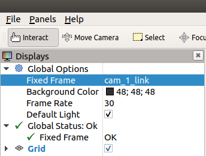
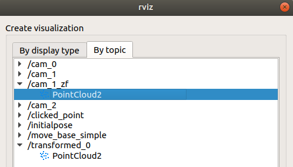
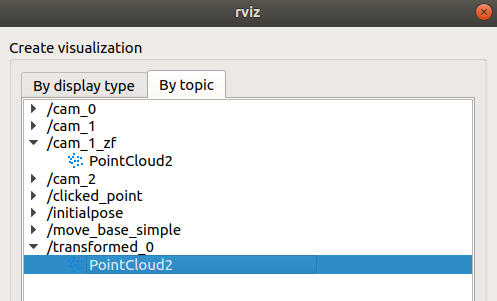
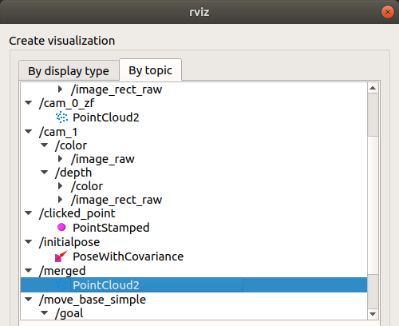
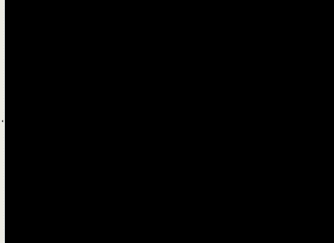

# 1. Stereo-calibrate

## Requirements

- [Realsense SDK](https://github.com/IntelRealSense/librealsense/blob/master/doc/distribution_linux.md#installing-the-packages)

- [ROS](http://wiki.ros.org/melodic/Installation/Ubuntu)

- [ROS wrapper for Realsense Camera](https://github.com/IntelRealSense/realsense-ros)

- Python3 package
	- numpy
	- opencv-python
	- pyrealsense2
	- argparse

- Python2 package
	- numpy
	- rospy
	- opencv-python
	- open3d-ros-helper
		- Dependencies
		  - ros-numpy
		  - open3d == 0.9

- [(option) tmux](#execute-all-procedures-at-a-time-using-tmux)

	`sudo apt install tmux`

## Camera calibration & Stereo calibration

### (option) Stream 
`./stereo-calib.py -s`

### Camera calibration
`./stereo-calib.py -c`
- Parameter: 
	- Board width(default: 9)
	- Board height(default: 6)
	- Board size(default: 0.0235)
	- Frame height(default: 1080)
	- Total count(default: 13)
	- Selected devices

### Stereo calibration
`./stereo-calib.py -sc -d [SELECTED_CAMERAS]`

- Parameter: 
	- Board width(default: 9)
	- Board height(default: 6)
	- Board size(default: 0.0235)
	- Frame height(default: 1080)
	- Total count(default: 13)
	- Selected devices(NOTE: Dependent on the order)
	---
	ex) `./stereo-calib.py -sc -d 1 0` -> Stereo-calibration from cam 1 to cam 0 
	- Base(center) camera: cam 1

# 2. Realsense ROS launch

## How to turn on the realsense camera to pointcloud map

- Turn on realsense cameras using launch file

	`roslaunch realsense2_camera rs_camera.launch camera:=cam_0 serial_no:=[SERIAL_NUMBER] filters:=spatial,temporal,pointcloud`

	`roslaunch realsense2_camera rs_camera.launch camera:=cam_1 serial_no:=[SERIAL_NUMBER] filters:=spatial,temporal,pointcloud`

- Transform from ROS coordinate to camera coordinate

	`./base_zf.py [BASE_CAMERA]`

	---
	ex) `./base_zf.py cam_1`
	- Base(center) camera's node name: cam_1

- Transform from camera 1 to camera 0

	`./send_transform.py [STEREO_CALIB.xml]`

	---

	ex) `./send_transform.py config/trans10.xml`

- Merge the pointcloud data

	`./merge.py`

- Rviz

	`rviz`

- Set the fixed frame

	ex) Base(center) camera frame: cam_1_link

	

- Select the topic data

	- Base camera

	

	- Side camera

	

	- If you want to add just one topic

	

### Result
- Raw pointcloud

	

- Stereo

	

- Stereo + Global registration

	

# Execute all procedures at a time using tmux

- Precondition
  - Install tmux

    `sudo apt install tmux`

  - Set the base camera (recommended: If you will use more than two cameras, you can select a camera located in the middle of the configuration.)

  - Stereo-calibration

    - If the number of cameras is more than three, it should be calibrated between the base camera and another.

- Methods
  1. Open linux terminal
  2. `./multi-view`
  3. `./base_zf.py [BASE_CAMERA]`
  4. `./send_tranform.py [STEREO_CALIB.xml]`
  5. `./merge.py`

---
- TODO: 
	1. How many do you want to use cameras?
	2. Only one command
	3. High accuracy
	4. If it was connected more than three cameras without [-d] option, it will only calibrated between first and second camera, not third. 

# multi_view
